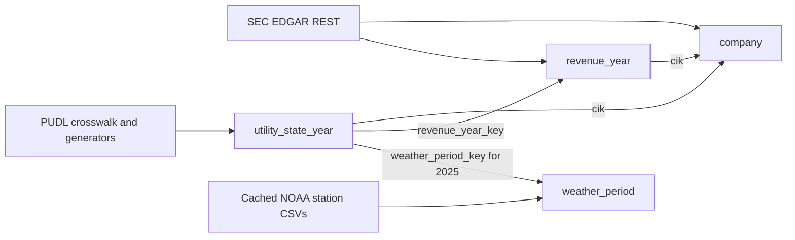

# Create an EDGAR, PUDL, and NOAA Unified Semantic Layer

This guide reproduces the model created and queried through the local Zetaris JDBC endpoint in this session on 2026-10-01. It is written for humans executing SQL and AI agents operating a JDBC client.

Start with [Connecting Codex to Zetaris](../connections/codex-connection.md). Connect and get a row containing `1` from `SELECT 1;` before registering sources or compiling the USL. The connection check does not depend on a sample database already existing.

The working model is `lightning.metastore.edgar_pudl_demo.edgar_pudl_noaa_usl`. It relates Dominion Energy's SEC revenue facts to PUDL generator data through a SEC CIK/EIA utility crosswalk, then attaches NOAA station observations to the 2025 state-level generation rows.

Follow these steps in order:

1. [Connect](#1-connect-first-and-establish-execution-scope).
2. [Inspect existing registrations](#2-inspect-existing-registrations-and-choose-a-model-name).
3. [Register missing sources](#3-register-the-required-sources).
4. [Check schemas and join keys](#4-confirm-schemas-and-the-cik-to-utility-match).
5. [Cache NOAA](#5-cache-the-noaa-tables-before-aggregation).
6. [Verify weather coverage](#6-read-the-cached-weather-data-and-assess-its-period).
7. [Compile the USL](#7-compile-and-deploy-all-four-table-definitions-together).
8. [Activate its tables](#8-activate-the-tables-in-dependency-order).
9. [Query the joined result](#9-query-the-activated-usl-and-verify-the-join).
10. [Run DQ separately](#10-run-dq-separately-and-record-its-result).

## What you will create

| USL table | Row grain | Source | Relationships |
|---|---|---|---|
| `company` | One SEC CIK | EDGAR REST | Parent of revenue and utility rows |
| `revenue_year` | CIK and report year | EDGAR REST | `cik` references `company` |
| `weather_period` | One selected station/state for the observed 2025 period | NOAA station CSVs | Referenced by 2025 utility rows |
| `utility_state_year` | Matched CIK, state, and report year | PUDL Parquet | References company, revenue year, and weather period |



The PUDL crosswalk is probabilistic and can contain incomplete or incorrect matches. Treat its CIK-to-utility association as an analysis link, not proof that the SEC company owns every generator in the matched utility's records. [PUDL crosswalk documentation](https://data.catalyst.coop/preview/pudl/core_sec10k__assn_sec10k_filers_and_eia_utilities).

In the successful run, each selected NOAA station contained 37 observed days from **2025-01-01 through 2025-02-06**. These station observations are partial weather context. They are not a full-year climate average or a statewide weather measure. The guide keeps the observed dates and day count in the USL output.

## 1. Connect first and establish execution scope

Follow the [connection guide](../connections/codex-connection.md), using the driver included in `zetaris-platform`:

| Setting | Local default |
|---|---|
| Driver JAR, relative to `zetaris-platform` | `jdbc/ndp-jdbc-driver-2.4.3.1-7eff043-driver.jar` |
| Driver class | `com.zetaris.lightning.jdbc.LightningDriver` |
| JDBC URL | `jdbc:zetaris:lightning@localhost:10000` |
| Credentials | Your assigned Zetaris user ID and password |

Use the actual host and port if your instance differs from that default. `localhost` means the machine running the JDBC client. A local database on your laptop is not automatically reachable as `localhost` from an agent running on another host.

Use Zetaris Lightning SQL through the supplied driver. Do not initialize Spark or create a local `SparkSession`. Human readers can use their JDBC client; AI agents should use the same direct JDBC route described in the connection guide. No repository application changes are needed to create this model.

Run one SQL statement per JDBC request and wait for its final result before issuing a dependent statement. Keep the JDBC connection open through caching and the queries that consume the cache where your client allows it. The exception to ordinary semicolon splitting is the `COMPILE USL ... DDL` block in step 7: all four `CREATE TABLE` definitions are one compile payload.

Set a real SEC application/contact identity before running the REST registration below. Replace `YOUR_APP_NAME YOUR_CONTACT_EMAIL`; do not automatically reuse the database login as the SEC contact. Keep database credentials out of SQL files, source control, and reports.

## 2. Inspect existing registrations and choose a model name

The registration commands below are for missing objects. Reuse matching existing objects rather than rerunning every `CREATE` statement.

```sql
SHOW LIGHTNING DATABASES;
```

For each database already present, inspect its tables:

```sql
SHOW LIGHTNING TABLES SEC_DATA;
```

```sql
SHOW LIGHTNING TABLES PUDL_S3;
```

```sql
SHOW LIGHTNING TABLES NOAA_GHCN_S3;
```

Only run these table-listing statements when the corresponding database exists. `SHOW DATASOURCES` alone is not a complete inventory of the Lightning REST/file databases used here.

Use the namespace and USL name shown in this guide for a fresh model. If `edgar_pudl_noaa_usl` already exists, inspect it in the USL interface before proceeding. `IF NOT EXISTS` should not be treated as an update operation. To build a separate version, choose a new USL name and replace it consistently in the compile, activation, and verification blocks. Do not remove an existing model merely to make these instructions run.

## 3. Register the required sources

These are the minimal registrations used by the successful model. The repo's [PUDL script](../../open_data/parquet_csv/sql/03_pudl_create.sql), [EDGAR script](../../open_data/rest_apis/sql/rate_limited/01_edgar_company_facts_create.sql), and [NOAA script](../../open_data/parquet_csv/sql/02_noaa_ghcn_create.sql) provide the underlying registration patterns. You do not need to register all of their example tables.

### 3.1 SEC EDGAR revenue facts

Create the logical database only if absent:

```sql
CREATE LIGHTNING DATABASE SEC_DATA DESCRIBE BY "SEC EDGAR company facts REST source";
```

Register Dominion Energy, CIK `0000715957`, after replacing the SEC User-Agent placeholder:

```sql
CREATE LIGHTNING REST TABLE dominion_revenue_facts FROM SEC_DATA REQUEST(
    endpoint "https://data.sec.gov/api/xbrl/companyconcept/CIK0000715957/us-gaap/Revenues.json",
    method "get",
    response_type "json",
    http_encoding "URLENCODED"
) HEADER (
    user-agent "YOUR_APP_NAME YOUR_CONTACT_EMAIL"
) BODY ();
```

This is company-wide `us-gaap:Revenues` data from [SEC EDGAR](https://www.sec.gov/search-filings/edgar-search-assistance/accessing-edgar-data). The response contains several contexts per filing and comparative periods repeated in later filings. Step 8 filters full-year facts and selects the latest filing for each period end.

### 3.2 PUDL utility mapping and generator history

Create the logical database only if absent:

```sql
CREATE LIGHTNING DATABASE PUDL_S3 DESCRIBE BY "Catalyst Cooperative PUDL S3 filestore source";
```

Register the SEC-to-EIA crosswalk:

```sql
CREATE LIGHTNING FILESTORE TABLE pudl_sec10k_utility_matches FROM PUDL_S3 FORMAT PARQUET OPTIONS (
  PATH "s3a://pudl.catalyst.coop/stable/core_sec10k__assn_sec10k_filers_and_eia_utilities.parquet",
  inferSchema "true",
  isS3BucketPublic "true",
  useS3PathStyleAccess "true",
  s3Endpoint "s3.us-west-2.amazonaws.com"
);
```

Register the generator history:

```sql
CREATE LIGHTNING FILESTORE TABLE pudl_eia_yearly_generators FROM PUDL_S3 FORMAT PARQUET OPTIONS (
  PATH "s3a://pudl.catalyst.coop/stable/out_eia__yearly_generators.parquet",
  inferSchema "true",
  isS3BucketPublic "true",
  useS3PathStyleAccess "true",
  s3Endpoint "s3.us-west-2.amazonaws.com"
);
```

These public-bucket options require no AWS credential values. The `stable` alias can change between PUDL releases. For a reproducible release-specific exercise, replace `stable` with a verified release path; inspect its schemas before reusing the activation SQL. See [PUDL data access](https://docs.catalyst.coop/pudl/en/stable/data_access.html).

### 3.3 NOAA station histories

Create the logical database only if absent:

```sql
CREATE LIGHTNING DATABASE NOAA_GHCN_S3 DESCRIBE BY "NOAA GHCN-Daily S3 filestore source";
```

Use the three station files below. This route avoids the full `csv/by_year/2025.csv` scan that took too long in the initial attempt. A station file contains historical observations, so caching it still requires an initial load.

```sql
CREATE LIGHTNING FILESTORE TABLE noaa_va_airport FROM NOAA_GHCN_S3 FORMAT CSV OPTIONS (
  PATH "s3a://noaa-ghcn-pds/csv/by_station/USW00013740.csv",
  inferSchema "false",
  header "false",
  isS3BucketPublic "true",
  useS3PathStyleAccess "true",
  s3Endpoint "s3.us-east-1.amazonaws.com"
);
```

```sql
CREATE LIGHTNING FILESTORE TABLE noaa_nc_airport FROM NOAA_GHCN_S3 FORMAT CSV OPTIONS (
  PATH "s3a://noaa-ghcn-pds/csv/by_station/USW00013722.csv",
  inferSchema "false",
  header "false",
  isS3BucketPublic "true",
  useS3PathStyleAccess "true",
  s3Endpoint "s3.us-east-1.amazonaws.com"
);
```

```sql
CREATE LIGHTNING FILESTORE TABLE noaa_sc_airport FROM NOAA_GHCN_S3 FORMAT CSV OPTIONS (
  PATH "s3a://noaa-ghcn-pds/csv/by_station/USW00013880.csv",
  inferSchema "false",
  header "false",
  isS3BucketPublic "true",
  useS3PathStyleAccess "true",
  s3Endpoint "s3.us-east-1.amazonaws.com"
);
```

| State context | Station ID | Station name |
|---|---|---|
| VA | `USW00013740` | Richmond International Airport |
| NC | `USW00013722` | Raleigh Airport |
| SC | `USW00013880` | Charleston International Airport |

These are one-station reference series for each state. They do not describe weather at every PUDL plant. The station IDs and names were checked against the NOAA station inventory during the original run. [NOAA GHCN-D documentation](https://www.ncei.noaa.gov/products/land-based-station/global-historical-climatology-network-daily).

## 4. Confirm schemas and the CIK-to-utility match

Inspect each source schema before constructing the USL:

```sql
DESCRIBE DATASOURCE TABLE SEC_DATA.dominion_revenue_facts;
```

```sql
DESCRIBE DATASOURCE TABLE PUDL_S3.pudl_sec10k_utility_matches;
```

```sql
DESCRIBE DATASOURCE TABLE PUDL_S3.pudl_eia_yearly_generators;
```

```sql
DESCRIBE DATASOURCE TABLE NOAA_GHCN_S3.noaa_va_airport;
```

Repeat the NOAA description for `noaa_nc_airport` and `noaa_sc_airport`. In the observed schema, NOAA exposed `_c0` through `_c7` as strings. The activation uses `_c1` for `YYYYMMDD` date, `_c2` for element, and `_c3` for data value. Adjust the SQL if your registration exposes different column names. Filtering valid date strings also excludes any header row.

The PUDL crosswalk must expose `central_index_key` and `utility_id_eia`. The generator table must expose `utility_id_eia`, `report_date`, `state`, `capacity_mw`, and `net_generation_mwh`.

Check the SEC identity as data, not just as an inferred column:

```sql
SELECT cik, entityName FROM SEC_DATA.dominion_revenue_facts;
```

The observed SEC CIK was numeric `715957`; the USL pads it to `0000715957` to match PUDL's string CIK. Confirm the name and CIK are present before using them as non-null keys.

Confirm the example's match and reporting coverage:

```sql
SELECT m.central_index_key, m.utility_id_eia,
       MAX(g.utility_name_eia) AS utility_name,
       g.report_date, g.state,
       COUNT(*) AS generator_count,
       SUM(g.net_generation_mwh) AS generation_mwh
FROM PUDL_S3.pudl_sec10k_utility_matches m
JOIN PUDL_S3.pudl_eia_yearly_generators g
  ON m.utility_id_eia = g.utility_id_eia
WHERE m.central_index_key = '0000715957'
  AND g.report_date BETWEEN DATE '2023-01-01' AND DATE '2025-12-31'
GROUP BY m.central_index_key, m.utility_id_eia, g.report_date, g.state
ORDER BY g.report_date, g.state;
```

The observed match was CIK `0000715957` to EIA utility `5248`, with nine state/year rows covering NC, SC, and VA for 2023–2025. If the match or coverage differs, resolve that difference before declaring matching foreign keys. The source had 2026 rows with missing generation, so this example deliberately ends in 2025.

## 5. Cache the NOAA tables before aggregation

Execute each statement separately and wait for completion:

```sql
CACHE TABLE NOAA_GHCN_S3.noaa_va_airport;
```

```sql
CACHE TABLE NOAA_GHCN_S3.noaa_nc_airport;
```

```sql
CACHE TABLE NOAA_GHCN_S3.noaa_sc_airport;
```

All three commands completed in the successful attempt. The first cache load took about 107 seconds. A slow initial load is not evidence that the subsequent query has failed.

Cache completion and query correctness are separate checks. Verify by running step 6. Cache persistence across reconnects and server restarts was not established in this exercise; do not treat caching as durable materialization. Keep the same JDBC connection open where possible, and warm the sources again when required by your deployment. `SHOW CACHE TABLES` is not used here as proof of explicit-cache membership; the repo's [SQL companion](zetaris-sql-companion.md#5-operational-limitations-confirmed-live-not-documentation-guesses) records limitations with that status command.

## 6. Read the cached weather data and assess its period

```sql
SELECT state,
       COUNT(DISTINCT obs_date) AS observed_days,
       MIN(obs_date) AS from_date,
       MAX(obs_date) AS through_date,
       AVG(CASE WHEN element = 'TMAX' THEN CAST(data_value AS DOUBLE)/10.0 END) AS mean_tmax_c,
       AVG(CASE WHEN element = 'TMIN' THEN CAST(data_value AS DOUBLE)/10.0 END) AS mean_tmin_c,
       AVG(CASE WHEN element = 'PRCP' THEN CAST(data_value AS DOUBLE)/10.0 END) AS mean_daily_precip_mm
FROM (
  SELECT 'VA' AS state, _c1 AS obs_date, _c2 AS element, _c3 AS data_value FROM NOAA_GHCN_S3.noaa_va_airport
  UNION ALL
  SELECT 'NC' AS state, _c1 AS obs_date, _c2 AS element, _c3 AS data_value FROM NOAA_GHCN_S3.noaa_nc_airport
  UNION ALL
  SELECT 'SC' AS state, _c1 AS obs_date, _c2 AS element, _c3 AS data_value FROM NOAA_GHCN_S3.noaa_sc_airport
) obs
WHERE obs_date BETWEEN '20250101' AND '20251231'
  AND element IN ('TMAX','TMIN','PRCP')
  AND CAST(data_value AS INT) <> -9999
GROUP BY state
ORDER BY state;
```

Temperatures and precipitation are divided by 10 to convert the source's tenths of degrees Celsius and tenths of millimetres. `mean_daily_precip_mm` is a mean over recorded precipitation days, not total annual rainfall. The query excludes the `-9999` missing-value sentinel; it does not apply additional NOAA quality-flag filtering.

Observed results from the cached aggregation:

| State | Days | Through date | Mean TMAX °C | Mean TMIN °C | Mean daily precipitation mm |
|---|---:|---|---:|---:|---:|
| NC | 37 | 2025-02-06 | 10.722 | -0.611 | 1.338 |
| SC | 37 | 2025-02-06 | 14.351 | 1.441 | 0.978 |
| VA | 37 | 2025-02-06 | 7.557 | -3.741 | 2.492 |

Check your actual dates. The following SQL uses `_2025_JANFEB` as the weather-period identifier from this run. If the live files now contain a different period, choose an accurate identifier and update it consistently in both the weather and utility activations. Do not label a partial interval as annual weather.

## 7. Compile and deploy all four table definitions together

Create the namespace if needed:

```sql
CREATE NAMESPACE IF NOT EXISTS lightning.metastore.edgar_pudl_demo;
```

Send this entire block as **one JDBC statement**. The semicolons terminate the embedded table definitions; do not split them into independent top-level requests.

```sql
COMPILE USL IF NOT EXISTS edgar_pudl_noaa_usl DEPLOY NAMESPACE lightning.metastore.edgar_pudl_demo DDL
CREATE TABLE company (
  cik          varchar(10) NOT NULL PRIMARY KEY,
  company_name varchar(200) NOT NULL
);

CREATE TABLE revenue_year (
  revenue_year_key varchar(20) NOT NULL PRIMARY KEY,
  cik              varchar(10) NOT NULL FOREIGN KEY REFERENCES company(cik),
  report_year      integer NOT NULL,
  period_start     date,
  period_end       date,
  revenue_usd      double,
  filing_date      date,
  accession_number varchar(30)
);

CREATE TABLE weather_period (
  weather_period_key      varchar(40) NOT NULL PRIMARY KEY,
  state                   varchar(2) NOT NULL,
  station_id              varchar(11) NOT NULL,
  station_name            varchar(60),
  period_start            date,
  period_end              date,
  observed_days           integer,
  valid_measurement_count integer,
  mean_daily_tmax_c       double,
  mean_daily_tmin_c       double,
  mean_daily_precip_mm    double
);

CREATE TABLE utility_state_year (
  utility_state_year_key varchar(40) NOT NULL PRIMARY KEY,
  cik                   varchar(10) NOT NULL FOREIGN KEY REFERENCES company(cik),
  revenue_year_key      varchar(20) FOREIGN KEY REFERENCES revenue_year(revenue_year_key),
  weather_period_key    varchar(40) FOREIGN KEY REFERENCES weather_period(weather_period_key),
  utility_id_eia        bigint NOT NULL,
  report_year           integer NOT NULL,
  state                 varchar(2) NOT NULL,
  generator_count       integer,
  net_generation_mwh    double,
  installed_capacity_mw double
);
```

A successful compile/deploy confirms the model definitions were accepted. It does not prove that activated tables will return rows.

## 8. Activate the tables in dependency order

The successful version activates each source separately and establishes the cross-source relationships with foreign keys. This avoids the direct raw SEC/PUDL join that hit an internal planning error in the first attempt.

The `COALESCE` expressions satisfy the declared `NOT NULL` schema when source expressions are reported as nullable. They are not substitutes for checking real missing keys. Confirm the source CIK, state, and report year are present; do not accept blank keys or zero IDs as valid business records.

### 8.1 Company from SEC

```sql
ACTIVATE USL TABLE lightning.metastore.edgar_pudl_demo.edgar_pudl_noaa_usl.company AS
SELECT
    COALESCE(LPAD(CAST(cik AS STRING), 10, '0'), '') AS cik,
    COALESCE(MAX(entityName), '') AS company_name
FROM SEC_DATA.dominion_revenue_facts
GROUP BY cik;
```

### 8.2 Annual revenue from SEC

```sql
ACTIVATE USL TABLE lightning.metastore.edgar_pudl_demo.edgar_pudl_noaa_usl.revenue_year AS
SELECT
    COALESCE(CONCAT(cik, '_', CAST(report_year AS STRING)), '') AS revenue_year_key,
    COALESCE(cik, '') AS cik,
    COALESCE(report_year, 0) AS report_year,
    period_start,
    period_end,
    revenue_usd,
    filing_date,
    accession_number
FROM (
    SELECT
        LPAD(CAST(cik AS STRING), 10, '0') AS cik,
        YEAR(CAST(fact.`end` AS DATE)) AS report_year,
        CAST(fact.start AS DATE) AS period_start,
        CAST(fact.`end` AS DATE) AS period_end,
        CAST(fact.val AS DOUBLE) AS revenue_usd,
        CAST(fact.filed AS DATE) AS filing_date,
        fact.accn AS accession_number,
        ROW_NUMBER() OVER (
            PARTITION BY fact.`end`
            ORDER BY fact.filed DESC, fact.accn DESC
        ) AS rn
    FROM SEC_DATA.dominion_revenue_facts
    LATERAL VIEW explode(units.USD) AS fact
    WHERE fact.form = '10-K'
      AND fact.fp = 'FY'
      AND DATEDIFF(CAST(fact.`end` AS DATE), CAST(fact.start AS DATE)) BETWEEN 330 AND 400
      AND YEAR(CAST(fact.`end` AS DATE)) BETWEEN 2023 AND 2025
) annual_facts
WHERE rn = 1;
```

`fp = 'FY'` alone is insufficient: the payload also included quarterly contexts from annual filings. The duration filter selects full-year contexts, and the window function chooses the most recently filed value for each period end. This partition is appropriate for the single-company source here; if you extend to multiple companies, partition by CIK and period end. `report_year` is the year of period end. For companies with a non-calendar fiscal year, review the alignment to PUDL's calendar reporting year before reusing this join.

### 8.3 Partial weather period from cached NOAA data

```sql
ACTIVATE USL TABLE lightning.metastore.edgar_pudl_demo.edgar_pudl_noaa_usl.weather_period AS
SELECT
    COALESCE(CONCAT(state, '_2025_JANFEB'), '') AS weather_period_key,
    COALESCE(state, '') AS state,
    COALESCE(station_id, '') AS station_id,
    COALESCE(station_name, '') AS station_name,
    CAST(CONCAT(SUBSTR(MIN(obs_date),1,4),'-',SUBSTR(MIN(obs_date),5,2),'-',SUBSTR(MIN(obs_date),7,2)) AS DATE) AS period_start,
    CAST(CONCAT(SUBSTR(MAX(obs_date),1,4),'-',SUBSTR(MAX(obs_date),5,2),'-',SUBSTR(MAX(obs_date),7,2)) AS DATE) AS period_end,
    COUNT(DISTINCT obs_date) AS observed_days,
    COUNT(*) AS valid_measurement_count,
    AVG(CASE WHEN element='TMAX' THEN CAST(data_value AS DOUBLE)/10.0 END) AS mean_daily_tmax_c,
    AVG(CASE WHEN element='TMIN' THEN CAST(data_value AS DOUBLE)/10.0 END) AS mean_daily_tmin_c,
    AVG(CASE WHEN element='PRCP' THEN CAST(data_value AS DOUBLE)/10.0 END) AS mean_daily_precip_mm
FROM (
    SELECT 'VA' AS state, 'USW00013740' AS station_id, 'RICHMOND INTL AP' AS station_name, _c1 AS obs_date, _c2 AS element, _c3 AS data_value FROM NOAA_GHCN_S3.noaa_va_airport
    UNION ALL
    SELECT 'NC' AS state, 'USW00013722' AS station_id, 'RALEIGH AP' AS station_name, _c1 AS obs_date, _c2 AS element, _c3 AS data_value FROM NOAA_GHCN_S3.noaa_nc_airport
    UNION ALL
    SELECT 'SC' AS state, 'USW00013880' AS station_id, 'CHARLESTON INTL AP' AS station_name, _c1 AS obs_date, _c2 AS element, _c3 AS data_value FROM NOAA_GHCN_S3.noaa_sc_airport
) obs
WHERE obs_date BETWEEN '20250101' AND '20251231'
  AND element IN ('TMAX','TMIN','PRCP')
  AND CAST(data_value AS INT) <> -9999
GROUP BY state, station_id, station_name;
```

### 8.4 PUDL generation linked to SEC and weather keys

```sql
ACTIVATE USL TABLE lightning.metastore.edgar_pudl_demo.edgar_pudl_noaa_usl.utility_state_year AS
SELECT
    COALESCE(CONCAT(m.central_index_key, '_', CAST(YEAR(g.report_date) AS STRING), '_', g.state), '') AS utility_state_year_key,
    COALESCE(m.central_index_key, '') AS cik,
    COALESCE(CONCAT(m.central_index_key, '_', CAST(YEAR(g.report_date) AS STRING)), '') AS revenue_year_key,
    CASE WHEN YEAR(g.report_date) = 2025 THEN CONCAT(g.state, '_2025_JANFEB') END AS weather_period_key,
    COALESCE(m.utility_id_eia, 0) AS utility_id_eia,
    COALESCE(YEAR(g.report_date), 0) AS report_year,
    COALESCE(g.state, '') AS state,
    COUNT(*) AS generator_count,
    SUM(g.net_generation_mwh) AS net_generation_mwh,
    SUM(g.capacity_mw) AS installed_capacity_mw
FROM PUDL_S3.pudl_sec10k_utility_matches m
JOIN PUDL_S3.pudl_eia_yearly_generators g
    ON m.utility_id_eia = g.utility_id_eia
WHERE m.central_index_key = '0000715957'
  AND g.report_date BETWEEN DATE '2023-01-01' AND DATE '2025-12-31'
GROUP BY m.central_index_key, m.utility_id_eia, YEAR(g.report_date), g.state;
```

`generator_count` counts generator-source rows at the inspected plant/generator/year grain. `SUM(net_generation_mwh)` ignores missing measurements; it is not proof that every counted generator reported generation. The weather key is deliberately null for 2023 and 2024 because this example has no weather-period table for those years.

All four activation commands returned `registered` in the successful attempt. That confirms activation-query registration, not complete execution verification.

## 9. Query the activated USL and verify the join

First read the weather table:

```sql
SELECT *
FROM lightning.metastore.edgar_pudl_demo.edgar_pudl_noaa_usl.weather_period;
```

The successful run returned three rows, one per station/state, with 37 observed days and 111 valid measurement rows each.

Then run the integrated query:

```sql
SELECT u.report_year, u.state,
       u.generator_count, u.net_generation_mwh, u.installed_capacity_mw,
       r.revenue_usd,
       w.station_id, w.period_start, w.period_end, w.observed_days
FROM lightning.metastore.edgar_pudl_demo.edgar_pudl_noaa_usl.utility_state_year u
JOIN lightning.metastore.edgar_pudl_demo.edgar_pudl_noaa_usl.revenue_year r
  ON u.revenue_year_key = r.revenue_year_key
LEFT JOIN lightning.metastore.edgar_pudl_demo.edgar_pudl_noaa_usl.weather_period w
  ON u.weather_period_key = w.weather_period_key
ORDER BY u.report_year, u.state;
```

This returned **nine rows** in the successful run: NC, SC, and VA for each of 2023, 2024, and 2025. Weather columns were null for 2023–2024 and populated for 2025.

| 2025 state | Generators | Generation MWh | Capacity MW | SEC company revenue USD | Weather station |
|---|---:|---:|---:|---:|---|
| NC | 1 | 147,803 | 79.9 | 16,506,000,000 | `USW00013722` |
| SC | 2 | 108,737 | 79.7 | 16,506,000,000 | `USW00013880` |
| VA | 27 | 1,883,021 | 4,210.4 | 16,506,000,000 | `USW00013740` |

The company-wide SEC revenue is repeated on each state row. Do not sum that column across states. The corresponding observed SEC revenues were USD 14,393,000,000 for 2023 and USD 14,459,000,000 for 2024. Preserve the separate company/year and utility/state/year grains when aggregating.

These figures are comparison points from the recorded run, not guaranteed outputs from a future `stable` PUDL release or newer SEC filing. Verify current results against the source tables when they differ.

## 10. Run DQ separately and record its result

The USL guide describes primary and foreign key constraints as generating DQ rules. To try the utility table's relationship checks:

```sql
RUN DQ TABLE lightning.metastore.edgar_pudl_demo.edgar_pudl_noaa_usl.utility_state_year;
```

Wait for actual rule results before calling DQ passed. In this session, the command returned no result within approximately three minutes, and the JDBC client was interrupted. **The DQ outcome remains unverified.** The successful nine-row joined SELECT is separate evidence and does not substitute for a DQ result.

Set a bounded wait appropriate to your deployment. If you cancel, use your JDBC client's cancellation mechanism and check whether the server operation ended. Disconnecting or interrupting a client alone does not establish server-side cancellation. Do not repeatedly launch the same DQ command while an earlier operation may still be running.

## Troubleshooting and reruns

| Symptom | What to do |
|---|---|
| `No suitable driver` for `jdbc:hive2://...` | Use the driver class and URL format in the connection guide; do not replace the Zetaris JAR with a Hive driver. |
| `Connection refused` | Check that the local instance is running and port 10000 is reachable from the JDBC client host. |
| Database or table already exists | Reuse and inspect the registration; do not blindly retry the same `CREATE`. A slow registration may finish after your client stops waiting. |
| NOAA column not found | Inspect the current schema. `_c0`–`_c7` are the names observed in this run. |
| NOAA query takes too long | Wait for the cache loads to finish, use the three station files, and check connection/cache scope. Do not default to a full annual-file scan. |
| `nullable -> NOT NULL` during activation | Check actual source keys first, then align the activation's nullability to the declared schema. This guide uses `COALESCE` for confirmed example keys. |
| Activation has an extra/missing column | Match the projection exactly to the table DDL. An earlier utility activation included `utility_name_eia`, which was not declared; removing it resolved that mismatch. |
| Raw SEC/PUDL cross-source join raises an internal planning error | Use the separate source activations and USL foreign-key relationships shown here. The final joined USL query succeeded in this model. |
| `NoClassDefFoundError` for `USLTable` or `RemoveUSL` | Record the exact server error and consult the deployment operator. These appeared in the earlier attempt. Caching is not a general fix for missing runtime classes, and the later successful read does not establish why the earlier error disappeared. |
| DQ does not return within your bounded wait | Report the outcome as unverified, record elapsed time, and check/cancel the operation before another attempt. |

No USL materialization or durable cache was created in this exercise. The earlier `edgar_pudl_energy_usl` remained alongside the new model because its removal command failed in that attempt. Reuse or version existing models deliberately; avoid cleanup commands that could remove someone else's objects.

## Suggested instruction for an AI agent

Attach this guide and the connection guide, then provide credentials through your approved credential mechanism. Use this task prompt after the connection is verified:

```text
Follow the EDGAR/PUDL/NOAA USL guide against the connected Zetaris instance.
Inspect and reuse existing source registrations. Register only missing objects.
Use the Zetaris JDBC driver and Lightning SQL, one statement per request.
Send the complete COMPILE USL DDL block as one payload.
Cache the three NOAA airport station tables before aggregation, then check
their actual date coverage. Keep partial weather periods explicit.
Activate each source separately and connect the USL tables with the documented
CIK/year and weather-period keys. Verify the weather SELECT and joined SELECT.
Treat registered activations, readable rows, and completed DQ as separate outcomes.
Do not edit application code, remove existing models, or claim DQ passed without
rule results. At the end, report the object names, rows returned, weather dates,
commands that failed or timed out, and the steps you took.
```

## Evidence boundary for this guide

Observed in the successful cached-weather attempt: `SELECT 1` returned a row; three NOAA cache commands completed; the raw NOAA aggregation returned three rows; the USL compiled/deployed; all four activations registered; the USL weather SELECT returned three rows; the integrated SELECT returned nine rows. The utility DQ check did not complete within the bounded wait. These steps were executed through JDBC without starting local Spark or editing repository application code.

This document reconstructs those successful SQL blocks from the session. Source names and paths were checked against the repository patterns while writing the guide; the complete guide has not been rerun from an empty instance as a new end-to-end installation test.
